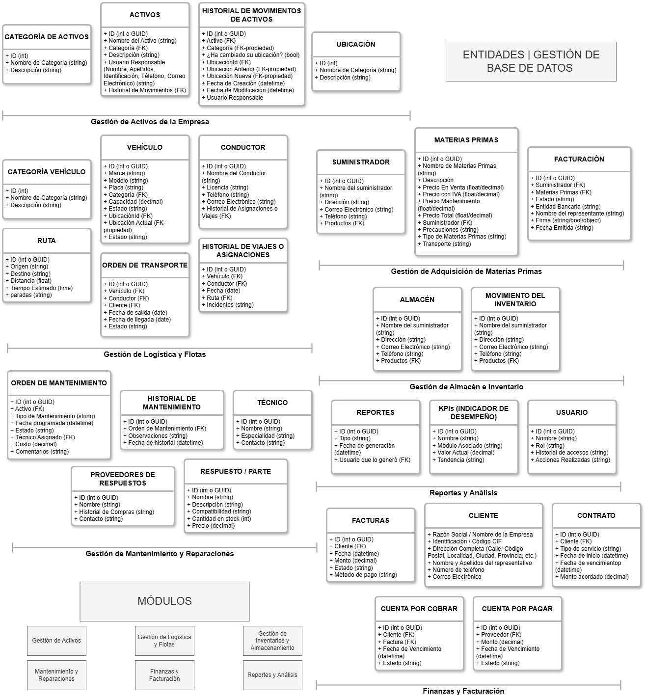

<h1>Proyecto ERP InfiniTrack Solutions</h1>
InfiniTrack Solutions es un sistema especializado en el monitoreo, rastreo y gestión de flotas de transporte, proporcionando soluciones integradas para optimizar la operación logística y reducir costos operativos.
 
<h3>🚚<b> ¿A qué se dedica?</b></h3>
 
Se especializa en el monitoreo, rastreo y gestión de flotas de transporte brindando soluciones a empresas que requieren: seguimiento GPS en tiempo real, optimización de rutas, mantenimiento preventivo y correctivo de vehículos, control de combustible y rendimiento, facturación y gestión de clientes. 
 
 
<h3>🎯<b> Objetivo</b>: </h3> 
 
Este proyecto busca proporcionar una solución ERP funcional y modular, que pueda adaptarse a distintas necesidades del sector logístico, optimizando la administración de flotas, seguimiento de envíos y gestión operativa.
 
 
<h3>📋<b> Problemas y Consultas</b>: </h3>
 
Se enfrentan a una falta de integración y automatización en la gestión de su operación de monitoreo y administración de flotas de transporte. Actualmente, utilizan diferentes sistemas y hojas de cálculo dispersas lo que genera: 
 
 
⛔ Errores en la gestión de datos (por ejemplo: duplicidad, inconsistencias).  
⛔ Falta de control en tiempo real sobre vehículos, rutas y costos.  
⛔ Dificultades en la facturación y administración financiera.  
⛔ Mantenimiento ineficiente, causando retrasos y sobrecostos.  

<h1>Módulos del ERP</h1>

Este esquema representa el modelo de datos del ERP InfiniTrack Solutions, organizando las principales entidades y relaciones dentro del sistema.  
 
<h3>📌 Áreas principales:</h3>
<ul>
  <li>Gestión de Activos 🏢</li>
  <li>Logística y Flotas 🚛</li>
  <li>Mantenimiento y Reparaciones 🔧</li>
  <li>Inventario y Almacén 📦</li>
  <li>Finanzas y Facturación 💰</li>
  <li>Reportes y Análisis 📊</li>
</ul>
<h3>Entidades o Gestión de base de datos</h3>
<table class="table table-striped">
  <thead>
    <tr>
      <th>Gestión de activos de la empresa</th>
      <th>Gestión de logística y flotas</th>
      <th>Gestión de adquisición de materias primas</th>
      <th>Gestión de almacén e inventario</th>
      <th>Gestión de mantenimiento y reparaciones</th>
      <th>Reportes y análisis</th>
      <th>Finanzas y facturación</th>
    </tr>
  </thead>
  <tbody>
    <tr>
      <td>
        <ul>
          <li>Categoría de activos</li>
          <li>Activos</li>
          <li>Historial de movimientos de activos</li>
          <li>Ubicación</li>
        </ul>
      </td>
      <td>
        <ul>
          <li>Categoría de vehículo</li>
          <li>Vehículo</li>
          <li>Conductor</li>
          <li>Ruta</li>
          <li>Orden de transporte</li>
          <li>Historial de viajes o asignaciones</li>
        </ul>
      </td>
      <td>
        <ul>
          <li>Suministrador</li>
          <li>Materias primas</li>
          <li>Facturación</li>
        </ul>
      </td>
      <td>
        <ul>
          <li>Almacén</li>
          <li>Movimiento del inventario</li>
        </ul>
      </td>
      <td>
        <ul>
          <li>Orden de mantenimiento</li>
          <li>Historiak de mantenimiento</li>
          <li>Técnico</li>
          <li>Proveedores de respuestos</li>
          <li>Respuesto o parte</li>
        </ul>
      </td>
      <td>
        <ul>
          <li>Reportes</li>
          <li>KPIs o Indicador de desempeño</li>
          <li>Usuario</li>
        </ul>
      </td>
      <td>
        <ul>
          <li>Facturas</li>
          <li>Cliente</li>
          <li>Contrato</li>
          <li>Cuenta por cobrar</li>
          <li>Cuenta por pagar</li>
        </ul>
      </td>
    </tr>
  </tbody>
</table>
 
 

 
 

